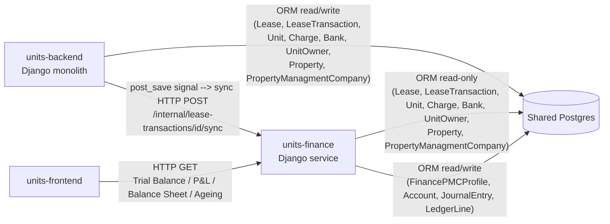
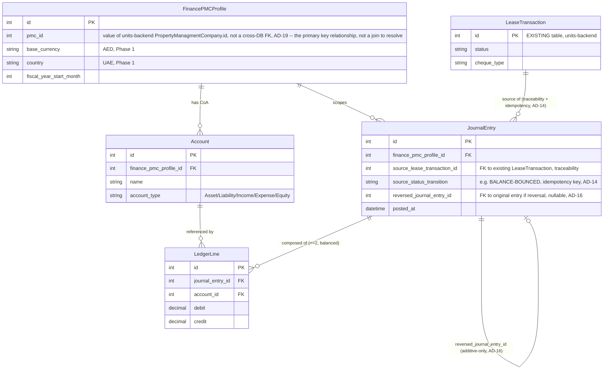

# Architecture Spine — Units Finance Module (Phase 1)

**Note on this file:** originally authored 2026-08-31, reconstructed 2026-09-01 after the `docs/` folder was accidentally deleted before commit (content restored from the authoring conversation; `prd.md` and `brainstorm-intent.md` were unaffected). Updated 2026-09-01 to inherit the platform-wide spine authored afterward at `_bmad-output/planning-artifacts/architecture/architecture-units-architecture-2026-09-01/ARCHITECTURE-SPINE.md` — see **Inherited Invariants** below. This reconciliation makes Finance's endpoints speak the same `{content, message, status}` envelope, JWT auth, and PMC-scoping as the rest of the platform, so the existing frontend interceptor and auth work against Finance unmodified. **Updated again 2026-09-01** to correct a domain-model error: there is no standalone "Company" entity — `PropertyManagmentCompany` ("PMC") IS the accounting entity, 1:1. This revision replaces the previously-proposed standalone `Company` model with `FinancePMCProfile` (Finance-owned accounting settings, keyed by the existing `PropertyManagmentCompany.id`) and drops the Unit-to-Company mapping table — `Unit` already resolves to its PMC via the existing `Unit.parent_property.pmc` chain (units-backend, `property` app). See `prd.md`'s matching 2026-09-01 revision note and Assumptions Index entry.

## Inherited Invariants

| Inherited | From parent | Binds here |
| --- | --- | --- |
| AD-1 (Cross-app data access) | Units Platform spine | Ratifies Finance's own AD-2/AD-5 read-only ORM access to units-backend tables — no conflict. |
| AD-2 (Access control enforcement) | Units Platform spine | Finance's external reporting endpoints must scope via `utilities.org_scope.get_pmc_ids_for_user()` — see AD-18 below. |
| AD-3 (API response envelope) | Units Platform spine | Every Finance endpoint returns `prepare_response()`'s `{content, message, status}` — see amended AD-1 below. |
| AD-4 (Role model) | Units Platform spine | No conflict — Finance's spine does not model roles; applies by default. |
| AD-5 (Role-based access, frontend) | Units Platform spine | No conflict — Finance's spine does not touch frontend structure; applies by default. |

## Design Paradigm

**Modular monolith siblings.** units-backend and units-finance are two independently-deployed Django projects (siblings under `microservices/`, each with its own `manage.py`, container, and codebase) that share one Postgres instance directly rather than communicating exclusively through APIs for data access. This is not a clean microservices split (no separate DB per service, no API-only contract for reads) and not a single monolith (separate deployables, separate codebases, separate ownership of tables) — it sits deliberately in between: each project internally follows a simple layered shape (views -> domain/posting logic -> models), and the *cross-project* boundary is enforced by convention (ownership of tables, one HTTP entry point) rather than by physical isolation. This fits the constraint set exactly: one shared Postgres (already decided, not negotiable), a 5-day solo build (no time for a real service-mesh/API-gateway pattern), and a brownfield host that has zero appetite for new infra (no message queue, no deployed Celery).

Layer mapping inside units-finance:
- `views.py` (function-based `@api_view` handlers, both internal sync endpoints and external reporting endpoints)
- `services/` or module-level posting functions (domain logic: account resolution, VAT calc, journal construction)
- `models.py` (`FinancePMCProfile`, `Account`, `JournalEntry`, `LedgerLine` — Finance-owned tables only; note `FinancePMCProfile` is accounting settings keyed to an existing `PropertyManagmentCompany`, not a new legal-entity model — see AD-19)

Cross-project rule: units-backend may only reach Finance through its internal HTTP API; Finance may only reach units-backend's tables through direct read-only Django ORM queries against the existing app's models (`Lease`, `LeaseTransaction`, `Unit`, `Charge`, `Bank`, and — for PMC resolution — `Property`/`PropertyManagmentCompany` via `Unit.parent_property.pmc`) — never through writes.

## Invariants & Rules



### AD-1 — Function-based views only, no DRF class-based views/serializers; response envelope matches the inherited platform convention [ADOPTED]
- **Binds:** all Finance API endpoints (internal sync + external reporting)
- **Prevents:** two API styles coexisting across units-backend and units-finance in one product; a future builder reaching for DRF ViewSets out of habit; Finance inventing its own `{data: ...}` or `{error: ...}` response shape the shared frontend interceptor can't parse
- **Rule:** every Finance endpoint is a function decorated with `@api_view`, with hand-rolled dict serialization functions (e.g. `serialize_journal_entry()`), matching units-backend's existing 100%-function-based convention exactly. No `ModelSerializer`, no `APIView` classes, no `ViewSet`. Every endpoint's HTTP response is wrapped in `utilities.helper_functions.prepare_response()` → `{content, message, status}` (inherited platform AD-3) — `serialize_*()` functions produce only the inner `content` payload; `prepare_response()` does the wrapping. A paginated reporting endpoint carries pagination via `prepare_response()`'s `paginator` argument, never nested inside `content`; see the Structural Seed note on which of the four reports actually paginate. On failure, `message` carries a short human-readable summary, `content` carries structured error detail (e.g. `{field: [...]}` validation errors), and `status` carries the HTTP status code — the same shape for both the internal sync endpoint (consumed by units-backend's AD-6 retry/logging) and reporting endpoints.

### AD-2 — Shared Postgres, no owned database [ADOPTED]
- **Binds:** all Finance data access
- **Prevents:** a second database, a sync/replication layer, or any "eventually consistent" copy of Units data inside Finance
- **Rule:** units-finance connects to the same Postgres instance and database as units-backend, using the same root `.env` variables (DB_NAME/DB_USER/DB_PASSWORD/DB_HOST/DB_PORT). Finance owns its own tables (`FinancePMCProfile`, `Account`, `JournalEntry`, `LedgerLine`, ...) inside that same database via its own Django app + migrations; it never creates a separate database or schema-per-service split.

### AD-3 — DB_HOST must resolve inside the Docker network
- **Binds:** deployment config for units_finance
- **Prevents:** the containerized Finance service failing to reach Postgres because it inherits a host-oriented `.env` value
- **Rule:** the root `.env`'s `DB_HOST` must be set to `postgres` (the compose service name), not `localhost`, for both units_backend and units_finance once units_finance is containerized. This is a pre-existing config item (currently `DB_HOST=localhost`, Postgres commented out) that must be fixed as part of this build, not deferred.

### AD-4 — LeaseTransaction post_save signal is the sole trigger mechanism
- **Binds:** FR-4 through FR-8 (all posting triggers)
- **Prevents:** a second trigger path (polling, a periodic Celery beat scan, a manual "resync" button as the primary path) that could double-post or drift out of sync with the signal path
- **Rule:** a single Django `post_save` signal on `LeaseTransaction`, added fresh in units-backend (the first `signals.py` in that codebase), is the only event source Finance listens to. units-backend is authoritative for detecting the event; Finance never polls `LeaseTransaction` for new/changed rows to drive posting.

### AD-5 — Signal calls Finance over synchronous internal HTTP, never direct writes
- **Binds:** the units-backend -> Finance integration path; FR-4 through FR-9
- **Prevents:** units-backend importing Finance models or writing Ledger/JournalEntry rows directly (which would blur ownership despite the shared database) and a second, competing posting-rules implementation living in units-backend
- **Rule:** the `post_save` signal handler in units-backend issues a synchronous HTTP POST to Finance's own internal API (`POST /internal/lease-transactions/{id}/sync`). All posting/accounting rules (account selection, VAT calculation, journal construction) live only in units-finance's codebase. units-backend never imports Finance models and never writes to `FinancePMCProfile`/`Account`/`JournalEntry`/`LedgerLine` tables, even though it has raw DB access to the same Postgres instance.

### AD-6 — Retry is synchronous in-request, no async infra
- **Binds:** the signal handler's HTTP call to Finance
- **Prevents:** introducing a queue, Celery worker/beat deployment, or Redis just to make this one call resilient; unbounded retry loops or unbounded request latency
- **Rule:** on failure, the signal handler retries synchronously with short backoff (e.g. 0.5s / 1s / 2s, 2-3 attempts total) within the same request/signal-handling cycle. If all retries are exhausted, the failure is logged loudly (matching the PRD's FR-2 "fails loudly" precedent) for manual reconciliation. The exact alerting mechanism beyond logging is deferred (see Deferred).

### AD-7 — Internal API requires a shared-secret header
- **Binds:** every endpoint under Finance's `/internal/` namespace
- **Prevents:** relying on Docker network isolation alone as the trust boundary between the two services
- **Rule:** units-backend sends `X-Internal-Token` on every call to Finance's internal API, with the value sourced from a `FINANCE_INTERNAL_TOKEN` env var shared via the root `.env`. Finance checks this header on every internal endpoint and rejects (401/403) any request missing it or presenting the wrong value.

### AD-8 — Celery/Redis are not available infrastructure for Phase 1 [ADOPTED]
- **Binds:** all Finance and units-backend integration design decisions in this phase
- **Prevents:** any Phase 1 design (e.g. an async posting queue, async retry) assuming Celery is live
- **Rule:** Celery is configured in units-backend's code (`celery.py`, `celery_config.py`, `django_celery_beat`, `@shared_task` usage) but has no deployed Redis, worker, or beat container. Nothing in Finance's Phase 1 design may depend on Celery actually running.

### AD-9 — Ownership share lives on UnitOwner, not a Finance side-table
- **Binds:** FR-9 (multi-owner commission split)
- **Prevents:** a second, Finance-owned source of truth for ownership percentage that can drift from the canonical property-app record
- **Rule:** `ownership_percent` is added as a new field on the existing `UnitOwner` model (`property` app, units-backend) via a small migration. Finance reads this field directly (read-only ORM access); Finance does not maintain its own unit-owner-share table.

### AD-10 — Finance service lives at microservices/units-finance as a Django sibling
- **Binds:** repository layout, docker-compose, deployment
- **Prevents:** Finance code being folded into units-backend as another app (which would blur the ownership/API boundary established by AD-5), or living outside the microservices/ convention
- **Rule:** Finance is a new sibling Django project at `microservices/units-finance/`, alongside `units-backend` and `units-frontend`, with its own `manage.py`. It is added as a new `units_finance` service block in the root `docker-compose.yml`, with `depends_on: postgres`, using the same `.env` pattern as units_backend (AD-3).

### AD-11 — Naming convention: project `finance_service`, primary app `ledger`
- **Binds:** Finance's internal Django project/app structure
- **Prevents:** an unresolved/placeholder naming question blocking the build; ad hoc naming drift between files
- **Rule:** following units-backend's own convention (project name `property_management`, lowercase snake_case app names like `property`, `lease`, `payment`), Finance's Django project package is named `finance_service` and its primary domain app is named `ledger` (holding `FinancePMCProfile`, `Account`, `JournalEntry`, `LedgerLine` models and the posting engine). The compose/container service name remains `units_finance` regardless of the internal project name — the two naming layers are independent and both fixed by this AD.

### AD-12 — Finance has its own requirements.txt and Dockerfile, independent of units-backend's
- **Binds:** Finance's Python dependency set and build
- **Prevents:** Finance being forced onto units-backend's dependency pins (notably its EOL Django version, AD-13); a shared-requirements-file merge conflict between the two projects
- **Rule:** `microservices/units-finance/` has its own `requirements.txt` and `Dockerfile` (or a sibling `docker_config/finance_python_config/` matching the existing `docker_config/python_config/` layout), built as its own image in `docker-compose.yml`'s `units_finance` service block. It never shares units-backend's `docker_config/python_config/requirements.txt`.

### AD-13 — units-backend's Django 4.0.0 (EOL) is a known, accepted, out-of-scope risk; Finance pins independently
- **Binds:** Finance's own Stack choice; explicitly does NOT bind units-backend
- **Prevents:** Finance inheriting an EOL framework version by default; silently ignoring the EOL risk without recording it
- **Rule:** units-backend's `requirements.txt` pins `django==4.0.0`, EOL since April 2023 — confirmed by reading the actual pin. Upgrading units-backend's Django version is explicitly out of scope for this Finance build (see Deferred). Because of AD-12, Finance's own `requirements.txt` is independent and pins a current Django LTS (5.x) rather than matching 4.0.0. **[Note: independently corroborated by the platform-wide spine's own Stack/Deferred sections — same finding, two separate reviews.]**

### AD-14 — Idempotency keys on the (from_status, to_status) transition, not just (id, target_status)
- **Binds:** the posting engine (FR-4 through FR-9), `JournalEntry`'s schema
- **Prevents:** two independently-built posting handlers disagreeing on whether a `LeaseTransaction` reaching the same status twice (e.g. BOUNCED → REPLACED → a new cheque later also REALIZED) is a legitimate re-posting or a duplicate signal fire
- **Rule:** every `JournalEntry` stores `source_lease_transaction_id` and `source_status_transition` (the exact `FROM_STATUS->TO_STATUS` pair). Before posting, the handler checks for an existing `JournalEntry` with that exact `(lease_transaction_id, from_status, to_status)` tuple; only an exact match is treated as a duplicate and skipped. A `LeaseTransaction` legitimately cycling through the same status more than once (e.g. across a replace cycle) is *not* blocked, because each occurrence's specific transition pair can differ in the real status history.

### AD-15 — `UnitOwner.ownership_percent` is NOT NULL with a mandatory backfill, never silently assumed
- **Binds:** the `UnitOwner` migration (units-backend), FR-9's split math (Finance)
- **Prevents:** existing multi-owner `Unit` rows going live with `NULL` or non-100%-summing percentages, causing FR-9 to silently miscompute or crash on unpredictable data
- **Rule:** the `ownership_percent` field is added `NOT NULL`, no default — the same migration step must backfill every existing multi-owner `Unit`'s `UnitOwner` rows so each `Unit`'s percentages sum to exactly 100 before Finance goes live. Finance's posting engine may assume this invariant always holds; if a `Unit`'s `ownership_percent` set does not sum to 100 at posting time, the post fails loudly (logged, no partial post — consistent with FR-2's precedent) rather than guessing a split.

### AD-16 — JournalEntry reversals are additive-only, never mutate-in-place
- **Binds:** FR-6 (bounce reversal), all balance-reporting queries (FR-10 through FR-13)
- **Prevents:** two independently-built features (a reversal-poster and a balance-reporter) disagreeing on whether "reversed" means an edited/deleted original entry or a new offsetting one — which would corrupt every downstream sum
- **Rule:** a reversal always posts a *new* `JournalEntry` carrying a `reversed_journal_entry_id` FK pointing at the original; the original entry is never edited or deleted. Every balance query (Trial Balance, P&L, Balance Sheet, Ageing) sums all `JournalEntry`/`LedgerLine` rows for the period unconditionally — reversals net out through summation, with no special-casing of a mutated original.

### AD-17 — External reporting endpoint auth is the same stateless JWT as units-backend, signed with a dedicated JWT secret (not Django's `SECRET_KEY`) [ADOPTED]
- **Binds:** Finance's external reporting endpoints (Trial Balance, P&L, Balance Sheet, Ageing) — distinct from AD-7, which governs only the internal units-backend→Finance sync path
- **Prevents:** Finance inventing a second, parallel auth mechanism for user-facing endpoints that units-frontend's existing `http.interceptor.ts` (which attaches `Authorization: Bearer <token>` project-wide) wouldn't work against unmodified; this spine assuming a secret-sharing mechanism that doesn't actually exist; Finance being handed Django's general-purpose `SECRET_KEY` (used for sessions, CSRF, and other signing beyond JWT) when only JWT verification is needed
- **Rule:** Finance's reporting views validate the same JWT units-backend issues (`utilities.jwt_token.py`, `pyjwt`, `Authorization: Bearer <token>`). **Prerequisite (verified not yet true, and corrected 2026-09-01):** `utilities/config.py` currently sets `JWT_SECRET_KEY = settings.SECRET_KEY` — JWT signing piggybacks on Django's general-purpose secret, and the root `.env` has no `SECRET_KEY`/`JWT_SECRET_KEY` entry today (`SECRET_KEY` is a hardcoded literal in `property_management/settings.py`). Sharing `SECRET_KEY` itself with Finance was rejected as too broad — it would hand Finance the ability to forge units-backend sessions/CSRF tokens, not just verify JWTs. As part of this build: units-backend gets a **new, dedicated `JWT_SECRET_KEY`** env var (a fresh random value, independent of `SECRET_KEY`), `utilities/config.py` is changed to read it via `os.getenv("JWT_SECRET_KEY")` instead of aliasing `settings.SECRET_KEY`, and only this narrower secret is added to the shared root `.env` and read by both services. Django's `SECRET_KEY` itself is never extracted into `.env` and never shared with Finance. Never a separate Finance-issued token for user-facing endpoints.

### AD-18 — Reporting endpoints are PMC-scoped via the inherited platform access-control convention [ADOPTED]
- **Binds:** FR-10 through FR-13 (Trial Balance, P&L, Balance Sheet, Ageing)
- **Prevents:** an Owner or Tenant querying Finance's reporting API and seeing another PMC's `FinancePMCProfile`s or JournalEntries; a second, Finance-local reimplementation of PMC-reachability logic diverging from units-backend's
- **Rule:** every reporting view calls `utilities.org_scope.get_pmc_ids_for_user()` (the same function, called the same way units-backend does, per inherited platform AD-2) and filters `FinancePMCProfile`/`JournalEntry` results to the PMCs the requesting user can reach — applied before any further scoping AD-2/AD-9 already do. See AD-19 for the direct `pmc_id` anchor and the JWT-to-`UserProfile` bridge this requires. This resolves the prior open question of per-actor reporting visibility at the PMC boundary; it does not by itself decide whether an Owner's Trial Balance should redact PMC-internal commission detail — that finer-grained redaction question remains open (see Deferred).

### AD-19 — `FinancePMCProfile` is keyed directly by `pmc_id`, not a separate "Company" entity; one shared helper bridges the JWT payload to a `UserProfile` [ADOPTED]
- **Binds:** FR-1 (`FinancePMCProfile` creation), AD-18's PMC-scoping
- **Prevents:** a builder inventing a standalone "Company" model distinct from `PropertyManagmentCompany` (the earlier, corrected error in this spine); two reporting endpoints filtering results by different resolution paths (a direct `pmc_id` field vs. a multi-hop `Unit` traversal); a hand-rolled JWT-payload-to-`UserProfile` lookup diverging from a single blessed helper, repeating the exact per-view reimplementation risk inherited AD-2 already warns against
- **Rule:** there is no standalone Company model. `FinancePMCProfile` is Finance's only Company-shaped table, and it is directly and permanently keyed by a required `pmc_id` field (integer, holding the value of units-backend's `PropertyManagmentCompany.id` — not a cross-database FK, since Finance and units-backend are separate Django projects sharing one Postgres instance per AD-2), set at `FinancePMCProfile`-creation time (`ledger/management/commands/`, FR-1). AD-18's scoping filters `FinancePMCProfile`/`JournalEntry` directly on `financepmcprofile.pmc_id ∈ get_pmc_ids_for_user()`'s returned list — never via `Unit` traversal, since `FinancePMCProfile.pmc_id` is the primary key relationship, not a join to resolve. Bridging AD-17's JWT payload (`{user_id, email, exp}`) into the `UserProfile`/role-subclass row `get_pmc_ids_for_user()` needs is done by one function defined once in `ledger/` (e.g. `get_user_profile_from_jwt(payload)`) and reused by every reporting view — never re-derived per-endpoint.

## Consistency Conventions

| Concern | Convention |
| --- | --- |
| Naming (entities, files, interfaces, events) | Compose/container service: `units_finance`. Django project package: `finance_service`. Primary app: `ledger`. Views: function-based `@api_view`, one file per resource area (`views.py` or `views_reporting.py`, `views_internal.py`). Serializer functions: `serialize_<noun>()` (e.g. `serialize_journal_entry()`), matching `serialize_lease()` in units-backend. Internal sync endpoint: `POST /internal/lease-transactions/{id}/sync`. |
| Data & formats (ids, dates, error shapes, envelopes) | IDs: integer PKs (Django default `id`), matching units-backend's existing models — no UUID migration introduced. Money: Decimal fields, 2 dp, AED implied for all Phase 1 Companies. Dates: ISO 8601 in API payloads. Response envelope: `prepare_response()` → `{content, message, status}` for every endpoint, inherited from the platform spine's AD-3 (AD-1). |
| State & cross-cutting (mutation, errors, logging, config, auth) | Auth (internal sync path): `X-Internal-Token` header checked against `FINANCE_INTERNAL_TOKEN` env var (AD-7). Auth (external reporting endpoints): stateless JWT, `Authorization: Bearer <token>`, validated the same way as units-backend (AD-17). Access control (external reporting endpoints): PMC-scoped via `utilities.org_scope.get_pmc_ids_for_user()`, inherited from the platform spine's AD-2 (AD-18). Config: same root `.env` file and `DB_HOST=postgres` convention as units-backend (AD-3). Mutation: every posting is one atomic DB transaction producing a fully balanced JournalEntry (debits == credits) or nothing — no partial posts; reversals are additive-only (AD-16). Logging: retry exhaustion and posting failures are logged at ERROR level with the source `LeaseTransaction.id` for manual reconciliation (AD-6). Idempotency: posting handlers key on `(lease_transaction_id, from_status, to_status)` — the exact transition, not just the target status (AD-14). |

## Stack

| Name | Version |
| --- | --- |
| Python (units-backend, unchanged) | 3.10.12 (pinned in existing Dockerfile) — approaching EOL 2026-10-31; not addressed by this build (Deferred) |
| Django (units-backend, unchanged) | 4.0.0 (pinned in existing requirements.txt) — EOL since April 2023; known, accepted, out-of-scope risk (AD-13, Deferred) |
| Python (units-finance, new) | current stable 3.12.x — independent pin via Finance's own requirements.txt (AD-12) |
| Django (units-finance, new) | current LTS 5.x — independent pin via Finance's own requirements.txt (AD-12, AD-13); verify the exact current LTS point release at build time |
| Django REST Framework (units-finance, new) | current version compatible with the chosen Django 5.x LTS (used only for `@api_view` / request-response plumbing, not ViewSets/Serializers); note DRF is not directly pinned in units-backend's own requirements.txt either — it arrives transitively via `drf-yasg` there, so Finance must pin it explicitly rather than assume a version to match |
| PostgreSQL | existing instance/version already running in docker-compose (`postgres:15-alpine`) — unchanged, shared by both services |
| Docker / docker-compose | existing root `docker-compose.yml`, extended with one new `units_finance` service block with its own build context (AD-12) |

## Structural Seed

**Pagination:** Trial Balance, P&L, and Balance Sheet are point-in-time/period snapshot documents, returned whole — never paginated. Ageing is a naturally growing list (one row per open item) — MUST paginate via `prepare_response()`'s `paginator` argument (inherited platform AD-3).

```text
microservices/units-finance/
  manage.py
  finance_service/            # Django project package (settings, urls, wsgi/asgi)
    settings.py
    urls.py
    wsgi.py
  ledger/                     # primary Finance app
    models.py                 # FinancePMCProfile, Account, JournalEntry, LedgerLine
    views_internal.py         # POST /internal/lease-transactions/{id}/sync
    views_reporting.py        # Trial Balance, P&L, Balance Sheet, Ageing, @api_view handlers
    posting.py                # posting engine: account resolution, VAT calc, journal construction (FR-4..FR-9)
    reconciliation.py         # bank statement import + match logic (FR-14, FR-15)
    serializers.py            # hand-rolled serialize_*() dict functions
    migrations/
    fixtures/                 # standard CoA seed fixture (FR-3)
    management/commands/      # FinancePMCProfile creation command (FR-1)
  requirements.txt          # Finance's own, independent of units-backend's (AD-12)
  Dockerfile                # Finance's own build; runs migrations on boot, mirroring deploy_commands.sh (see Deferred)
```



**Unit → PMC resolution (not a Finance-owned relationship):** `Unit` is not drawn above because Finance does not own or extend that edge. A `Unit`'s `FinancePMCProfile` is resolved at posting/query time by reading the existing units-backend chain — `Unit.parent_property.pmc.id` (via `Property`/`PropertyManagmentCompany`, both existing units-backend tables) — and matching it against `FinancePMCProfile.pmc_id` (AD-19). No new mapping table exists or is needed.

New (Finance-owned): `FinancePMCProfile`, `Account`, `JournalEntry` (carries `source_status_transition` for idempotency and `reversed_journal_entry_id` for additive-only reversals), `LedgerLine`, plus reconciliation tables (`BankStatementLine`, match records). Finance is the sole writer of all of these; there is no Finance-owned Unit-mapping table (see resolution note above).
Existing (read by Finance, read/write-owned by units-backend): `Lease`, `LeaseTransaction`, `Unit`, `Charge`, `Bank`, `UnitOwner` (gains `ownership_percent`, NOT NULL with mandatory backfill, AD-9/AD-15), and — for PMC resolution only — `Property`/`PropertyManagmentCompany`.

## Capability → Architecture Map

| Capability / Area | Lives in | Governed by |
| --- | --- | --- |
| `FinancePMCProfile` / CoA setup (FR-1, FR-3) | `ledger/models.py`, `ledger/management/commands/`, `ledger/fixtures/` | AD-2, AD-9, AD-11, AD-15, AD-19 |
| Unit -> PMC resolution (existing chain, no new table — FR-2 retired) | Reads existing units-backend `Unit.parent_property.pmc` (`property` app); Finance owns no table for this | AD-19 |
| Posting engine — rent AR, clearing, bounce, reversal, deposit, commission split (FR-4–FR-9) | `ledger/posting.py`, invoked from `views_internal.py` | AD-4, AD-5, AD-6, AD-9, AD-14, AD-15, AD-16; State/cross-cutting convention (atomicity, idempotency) |
| units-backend trigger + internal API contract | `LeaseTransaction` `post_save` signal (units-backend, new `signals.py`) -> `POST /internal/lease-transactions/{id}/sync` (units-finance) | AD-1, AD-4, AD-5, AD-6, AD-7 |
| Reporting — Trial Balance, P&L, Balance Sheet, Ageing (FR-10–FR-13) | `ledger/views_reporting.py`, called by units-frontend | AD-1, AD-16, AD-17, AD-18, AD-19; Data & formats convention |
| Bank Reconciliation (FR-14, FR-15) | `ledger/reconciliation.py` | Naming/Data conventions; no new AD (heuristic match, no invariant beyond FR-15's NFR) |
| Deployment / infra | root `docker-compose.yml` (`units_finance` service), root `.env`, Finance's own `requirements.txt`/Dockerfile | AD-3, AD-10, AD-12, AD-13 |

## Deferred

- **Multi-currency FX overlay** — all Phase 1 `FinancePMCProfile`s are AED/UAE only; no cross-currency reporting need exists yet (PRD §6.2).
- **Non-UAE PMCs** — the `FinancePMCProfile` data model supports it, but Phase 1 validates only UAE PMCs; explicit Phase 2 scope (PRD §1, §6.2).
- **Organization-level consolidated reporting** — summing Trial Balance/P&L/Balance Sheet/Ageing across all PMCs under one `Organization` (via `PropertyManagmentCompany.organization_id`) is not built in Phase 1, which reports strictly per-`FinancePMCProfile`. Achievable later without a data model change, since `FinancePMCProfile.pmc_id` already anchors to the correct PMC row — only a new aggregation query is needed, not a schema change. Deferred to Phase 2 (PRD §6.2, clarified 2026-09-01).
- **units-frontend UI** — Phase 1 ships the Finance backend and reporting API only (FR-10–FR-13), verified via Swagger/Postman/automated tests. The units-frontend "Finance" section for a logged-in Owner/PMC user (PRD UJ-1) is real, intended, and deferred to Phase 2, not built in this spine's scope (PRD §6.2, clarified 2026-09-01).
- **Celery/async activation** — no deployed Redis/worker/beat; not needed since retry is synchronous in-request (AD-6, AD-8); revisit only if retry/latency needs outgrow synchronous handling.
- **Manual journal-entry UI** — Phase 1 posting is fully automated from `LeaseTransaction`/`Lease` events; no accountant-facing entry screen (PRD §5, §6.2).
- **Configurable Chart of Accounts editor** — Phase 1 uses the fixed seeded CoA per `FinancePMCProfile`; revisit only if a client needs non-standard accounts (PRD §4.1).
- **Live bank feed/API integration** — Phase 1 reconciliation is manual CSV upload only (PRD FR-14 Out of Scope, §6.2).
- **Event/webhook layer for host-app notifications** — Finance relies on the existing shared-DB + signal path; no separate notification/webhook mechanism to units-backend or tenants (PRD §6.2, brainstorm-intent.md §8).
- **Alerting mechanism for final-failure retry case** — logged loudly per AD-6, but the actual alert channel (email/Slack/ops dashboard) is not chosen; not a Phase 1 blocker.
- **Per-actor commission-detail redaction within the PMC boundary** — PMC-level visibility scoping is now resolved by AD-18 (inherited platform AD-2 / `get_pmc_ids_for_user()`). What remains open: whether an Owner's Trial Balance should additionally exclude PMC-internal commission detail *within* a PMC they can already see (PRD Open Question 9). Phase 1 reporting endpoints are PMC-scoped (AD-18) with no further role-based redaction beyond that.
- **Reporting migration decision** — whether existing client-side rent analytics/ageing/revenue dashboards in units-backend get replaced by calls to Finance's API or continue running in parallel is unresolved (PRD Open Question 10); both may coexist through Phase 1.
- **units-backend's Django 4.0.0 upgrade** — EOL since April 2023 (AD-13); a real risk, but upgrading an existing production Django monolith is out of scope for a 5-day Finance build. Revisit as its own initiative.
- **`.env` DB_HOST rollout coordination** — the `DB_HOST=localhost -> postgres` fix (AD-3) requires a `docker-compose up -d --force-recreate` of `units_backend` (env vars are baked in at container creation, not read live), timed to happen once, together with `units_finance`'s first deploy. The exact operational runbook/script for this single cutover step is not written here; do it deliberately, not as an incidental side effect of an unrelated deploy. The new dedicated `JWT_SECRET_KEY` env var (AD-17) is the same class of one-time cutover and should be coordinated in the same rollout step.
- **FR-10 (Ledger-sourced) vs. FR-13 (LeaseTransaction.status-sourced) staleness window** — during AD-6's retry window (bounded, ~2-3 seconds), a cheque's status may have changed in units-backend before Finance's Ledger reflects it, so Trial Balance and Ageing could disagree briefly for the same cheque. Accepted as a known, bounded staleness window rather than architected away; not worth new infra for this timeline.
- **AD-15's `UnitOwner` backfill sequencing vs. Finance's independent first deploy** — no ordering guarantee is stated between the mandatory backfill (units-backend) and Finance going live; same hazard class as the `DB_HOST`/`JWT_SECRET_KEY` cutover above. Revisit together with that item's operational runbook rather than architected separately here.
- **AD-7/AD-17 hybrid auth case** — a foreseeable future dry-run/preview variant of the internal sync endpoint exposed to the frontend, or a server-to-server reporting call from units-backend (relevant if the "reporting migration" item above is picked up), wouldn't cleanly fit either the internal shared-secret or the user-facing JWT mechanism as currently scoped. No such endpoint exists in Phase 1; revisit if one is added.
</content>
